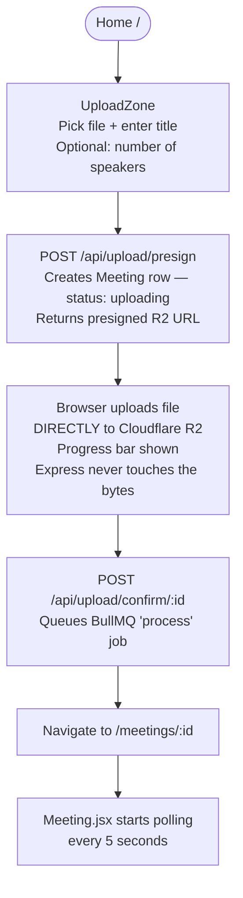
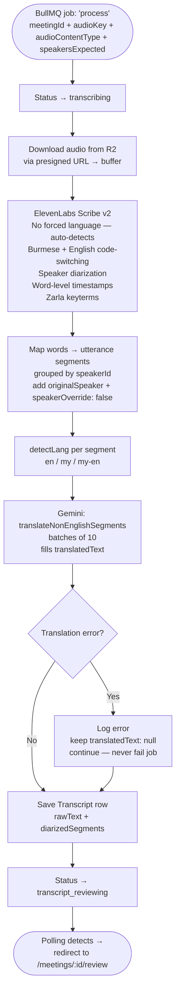
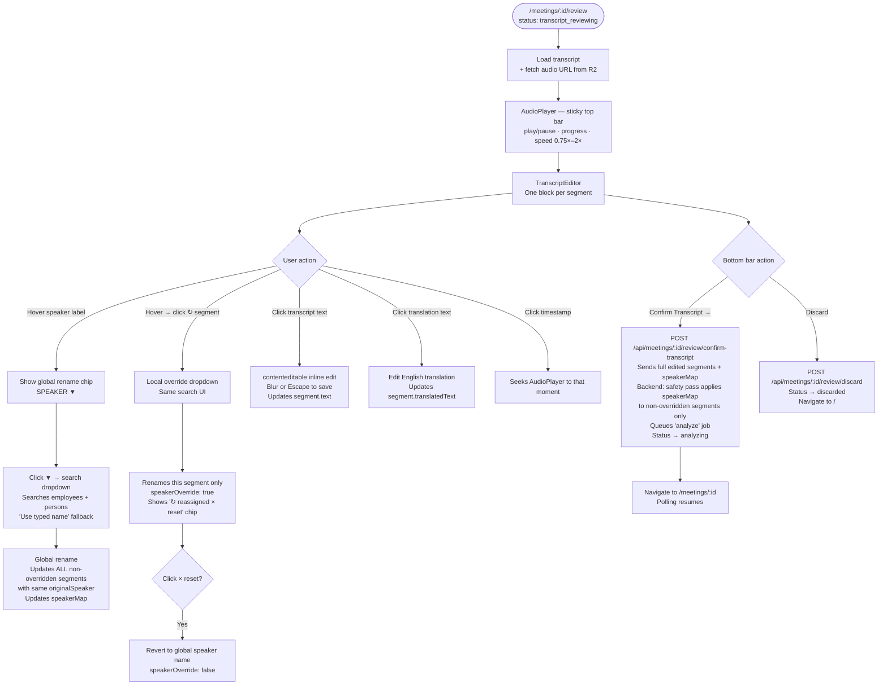
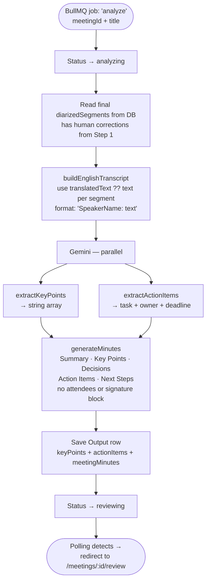
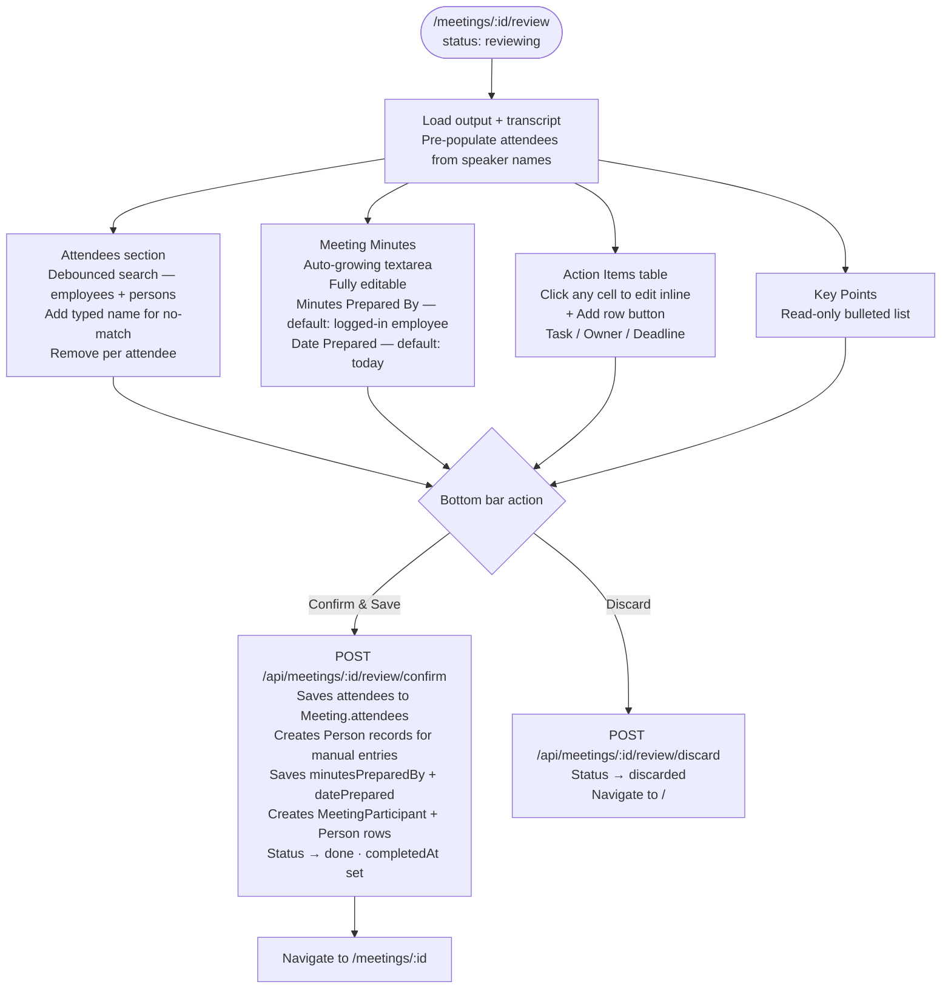
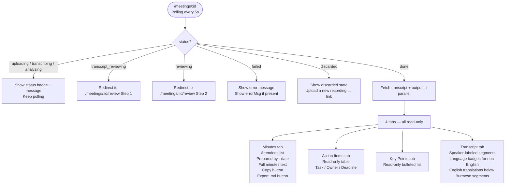
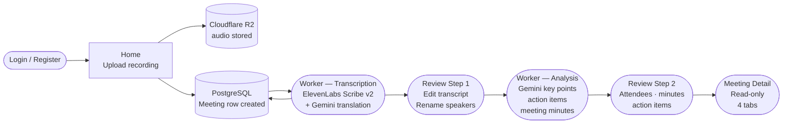

# InMinutes — Application Flows

Render with any Mermaid-compatible viewer (GitHub, VS Code + Mermaid extension, Obsidian).

---

## 1. Auth Flow

```mermaid
flowchart TD
    A([User visits any page]) --> B{Has valid JWT?}
    B -- No --> C[Redirect to /login]
    B -- Yes --> D[Load page normally]

    C --> E{Register or Login?}
    E -- Register --> F[/register\nname + email + password + jobTitle]
    E -- Login --> G[/login\nemail + password]

    F --> H[POST /api/auth/register\nCreates Employee + Person record]
    G --> I[POST /api/auth/login\nbcrypt.compare password]

    H --> J[Returns JWT token]
    I --> J

    J --> K[Store token in localStorage]
    K --> L[Redirect to /]
```

---

## 2. Upload Flow



---

## 3. Worker Pipeline — Transcription



---

## 4. HITL Review — Step 1: Transcript



---

## 5. Worker Pipeline — Analysis



---

## 6. HITL Review — Step 2: Output



---

## 7. Meeting Detail — Read-Only



---

## 8. Full End-to-End


